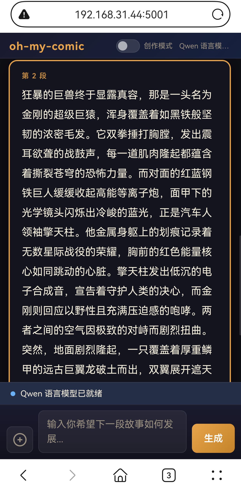
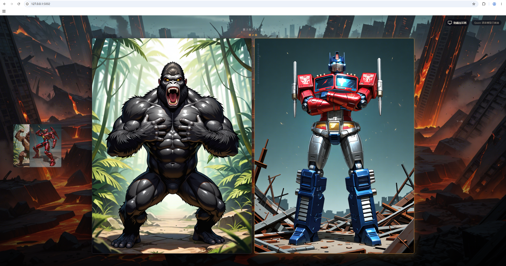

# oh-my-comic WebUI

> **English README** is below. **中文说明**请见本文件下半部分。

---

## English README

A locally-deployed interactive comic story system powered by llama-server (LLM), SDXL / ZImage, and Qwen Edit image generation.

- **Mobile (port 5001)**: Story text display, direction input, image upload, creative mode toggle
- **Desktop (port 5002)**: Full-screen background, comic strip character portraits, auto-sync with mobile scroll

---

### Features

#### Normal Mode

```
User inputs direction
→ LLM generates story JSON (text + character prompt + edit_prompt + background prompt)
→ LLM shuts down, VRAM freed
→ New characters: SDXL or ZImage text-to-image (SDXL batched; ZImage serial)
→ Recurring characters: Qwen Edit img2img (sdxl_hybrid / zimage_hybrid mode, serial)
→ LLM pre-warmed again after image generation
```

#### Story Starter Wizard (Quick Start)

```
Tap "✨ Quick Start" on the empty story screen
→ LLM generates 3 rating-aware opening questions (tone / protagonist / opening scene)
→ User taps one option per question (no typing required)
→ Tap "Generate Random Story Opening"
→ LLM creates the first segment using a dedicated starter prompt
→ Story and images generated normally from here
```

The questions and options are generated by Qwen based on the current `PROMPT_RATING`, so the
atmosphere of the choices automatically matches the configured content level.

#### Creative Mode

```
Enable creative mode (requires LLM ready)
→ LLM stays running
→ User writes multiple segments; only text is generated, no images
→ Disable creative mode
→ LLM shuts down, VRAM freed
→ All pending images generated in one batch
→ LLM pre-warmed again
```

#### Image Upload (Multimodal)

```
User uploads 1 image + text
→ Uploaded image is normalised to RGB JPEG (max 1440px) before sending to LLM vision
  (handles HEIF/HEIC disguised as .jpg, CMYK, oversized images, EXIF orientation)
→ LLM (requires LLAMA_MMPROJ_MODEL) parses image content
→ Backend injects "only the uploaded character this round" constraint (one-time, not stored in history)
→ Image description + user text + constraint merged as story input
→ LLM generates story JSON
→ Only background image generated; no character image generated
→ If JSON contains character_prompts[0].id, uploaded image is saved as true RGB PNG
  and bound as that character's portrait
→ That character uses Qwen Edit for consistency in all future segments
→ If image parsing fails (e.g. unsupported format), generation is aborted with a clear error
  message — the story is NOT polluted with a corrupted image description
```

---

### Hardware Requirements

| Component | Minimum | Recommended |
|-----------|---------|-------------|
| VRAM | 16 GB | 24 GB+ |
| RAM | 32 GB | 64 GB+ |
| GPU | RTX 4080 | RTX 4090 |
| Estimated time per round | — | 120–150 seconds |

---

### Installation

#### 1. Python dependencies

```bat
pip install -r requirements.txt
```

> **Note:** `torch==2.5.1`, `diffusers==0.38.0`, `transformers==4.57.3` are the recommended versions.

#### 2. stable-diffusion-cpp-python (Qwen Edit — must compile from source with CUDA)

```bat
git clone https://github.com/william-murray1204/stable-diffusion-cpp-python
cd stable-diffusion-cpp-python
```

Windows CMD:
```bat
set CMAKE_ARGS=-DSD_CUDA=ON
pip install .
```

Windows PowerShell:
```powershell
$env:CMAKE_ARGS="-DSD_CUDA=ON"
pip install .
```

> Do **NOT** install via `pip install stable-diffusion-cpp-python` directly — it will not have CUDA support.

#### 3. llama.cpp (LLM server)

Download and compile llama.cpp with CUDA 12.4, or use a pre-built release:

- Source: https://github.com/ggml-org/llama.cpp
- Pre-built releases: https://github.com/ggml-org/llama.cpp/releases

#### 4. flash-attention2 (optional, required for ZImage attention backend)

On Windows, install a pre-built wheel matching your Python + CUDA + torch version:

- Pre-built wheels: https://github.com/kingbri1/flash-attention/releases
- Recommended version: `flash_attn==2.7.4.post1`

> Do **NOT** run `pip install flash-attn` on Windows — it will fail to compile.

#### 5. Configure environment

```bat
copy .env.example .env
```

Fill in your model paths and settings.

#### 6. Run

Mock mode (no models required, for UI testing):
```bat
python app.py --mock
```

Real mode:
```bat
python app.py
```

Read-only mode (display existing story, no generation):
```bat
python app.py --serve-only
```

---

### Access

After startup, the terminal shows:

```
  oh-my-comic WebUI
  Mobile  : http://192.168.1.x:5001
  Desktop : http://127.0.0.1:5002
```

- **Mobile**: Connect to the same LAN, open `http://<PC_LAN_IP>:5001`
- **Desktop**: Open `http://127.0.0.1:5002`

---

### Project Structure

```
oh-my-comic/
├── app.py                              # Main application
├── requirements.txt                    # Python dependencies
├── .env.example                        # Config template (copy to .env and fill in)
├── zimage_worker.py                    # ZImage subprocess worker
├── data/
│   ├── story.json                      # Story data (auto-generated at runtime)
│   ├── raw_llm_response.txt            # Raw LLM output (for debugging)
│   ├── last_error.txt                  # Last error details (for debugging)
│   └── uploads/                        # User-uploaded images (auto-created)
├── static/
│   ├── css/style.css
│   ├── js/
│   │   ├── mobile.js
│   │   └── desktop.js
│   └── generated/                      # Generated images (auto-created)
├── templates/
│   ├── mobile.html                     # Mobile page
│   └── desktop.html                    # Desktop page
└── prompts/
    ├── story_system_prompt.txt         # System prompt (Chinese, customizable)
    ├── story_system_prompt_en.txt      # System prompt (English)
    ├── story_user_template.txt         # SDXL / sdxl_hybrid template (Chinese)
    ├── story_user_template_en.txt      # SDXL / sdxl_hybrid template (English)
    ├── story_user_template_zimage.txt  # ZImage / zimage_hybrid template (Chinese)
    └── story_user_template_zimage_en.txt  # ZImage / zimage_hybrid template (English)
```

---

### Key Configuration (`.env`)

| Variable | Default | Description |
|----------|---------|-------------|
| `UI_LANGUAGE` | `zh-CN` | WebUI language: `zh-CN` or `en-US` |
| `STORY_LANGUAGE` | `zh-CN` | LLM story output language: `zh-CN` or `en-US`. Defaults to `UI_LANGUAGE` if not set. |
| `ENABLE_BACKGROUND_GENERATION` | `true` | Set to `false` to skip background image generation entirely, regardless of `IMAGE_GENERATION_MODE`. |
| `IMAGE_GENERATION_MODE` | `sdxl_only` | `sdxl_only` / `sdxl_hybrid` / `zimage_hybrid` |
| `PROMPT_RATING` | `general` | `general` / `sensitive` / `questionable` / `explicit`. Also controls the Story Starter Wizard questions and opening story. |
| `ZIMAGE_RUN_MODE` | `subprocess` | `subprocess` (recommended) / `inprocess` |
| `VISION_MAX_SIDE` | `1440` | Maximum pixel dimension for uploaded images sent to LLM vision. Larger images are resized before sending. |
| `VISION_JPEG_QUALITY` | `90` | JPEG quality for the normalised vision image (1–95). |

#### Image Generation Modes

| Mode | Base engine | Recurring characters | Prompt template | Style |
|------|-------------|---------------------|-----------------|-------|
| `sdxl_only` | SDXL (batch) | SDXL | `story_user_template[_en].txt` | Anime |
| `sdxl_hybrid` | SDXL (batch) | Qwen Edit | `story_user_template[_en].txt` | Anime |
| `zimage_hybrid` | ZImage (serial) | Qwen Edit | `story_user_template_zimage[_en].txt` | Realistic |

#### Language Settings

- `UI_LANGUAGE=en-US` → WebUI buttons, status messages, and API responses in English
- `STORY_LANGUAGE=en-US` → LLM generates story text and prompts in English; English prompt templates are used automatically
- Both can be set independently. Example: `UI_LANGUAGE=en-US` + `STORY_LANGUAGE=zh-CN` = English UI, Chinese story.

#### ZImage Memory Note

ZImage + accelerate CPU offload may leave CPU RAM residue in a long-running process. The default `ZIMAGE_RUN_MODE=subprocess` runs ZImage in a child process; when the child exits, the OS reclaims all memory, so Qwen Edit is not slowed down.

---

## How to restart:

Delete these files and restart: python app.py

```bat
del data
del static\generated
```

---

### FAQ

**Q: Mobile cannot access port 5001**
A: Check Windows Defender Firewall — allow Python inbound on port 5001.

**Q: llama-server startup timeout**
A: A 27B model may take 1–2 minutes to load. The status bar shows elapsed time.

**Q: LLM returns Chinese even when I type in English**
A: Set `STORY_LANGUAGE=en-US` in `.env`. This switches to the English prompt templates, which instruct the LLM to output English story text and prompts.

**Q: How to disable background image generation**
A: Set `ENABLE_BACKGROUND_GENERATION=false` in `.env`. Background prompts are still generated by the LLM (for reference), but no background images are created.

**Q: ZImage leaves high CPU RAM after generation, slowing down Qwen Edit**
A: This is a known issue with ZImagePipeline + accelerate offload in a long-running process. The default `ZIMAGE_RUN_MODE=subprocess` solves this by running ZImage in a child process that exits after generation, letting the OS reclaim all memory.

**Q: How can I start a random story with minimal typing?**
A: Tap the "✨ Quick Start" card on the empty story screen. Qwen will generate 3 opening questions (tone, protagonist, opening scene) based on the current `PROMPT_RATING`. Tap one option per question, then tap "Generate Random Story Opening". No typing required.

**Q: Uploaded image causes HTTP 400 or "image parsing failed"**
A: The backend now normalises all uploaded images to RGB JPEG before sending to LLM vision, so most format issues are handled automatically. If you see a 400 error, it may be a HEIF/HEIC file. Either:
- Install `pillow-heif` for automatic HEIF support: `pip install pillow-heif`
- Or convert the image to JPG/PNG before uploading.

**Q: How to support HEIF/HEIC uploads (iPhone photos)**
A: Install the optional dependency: `pip install pillow-heif`. After that, HEIF/HEIC files (including those disguised as `.jpg`) are automatically converted to JPEG before being sent to LLM vision and saved as PNG for Qwen Edit reference.

---

---

# oh-my-comic WebUI 中文说明

一个基于本地部署的 LLM（llama-server）、SDXL / ZImage 和 Qwen Edit 画图模型运行的自由创作互动连环画系统。

- **手机端（5001 端口）**：展示故事文本和用户消息，输入下一段剧情方向，支持上传图片，支持创作模式开关
- **电脑端（5002 端口）**：全屏背景图随剧情切换，连环画展示角色立绘，手机滚动自动同步

---

## 功能概述

### 普通模式

```
用户输入方向
→ LLM 生成故事 JSON（文本 + 角色 prompt + edit_prompt + 背景 prompt）
→ 关闭 LLM，释放显存
→ 新角色：SDXL 或 ZImage 文生图（SDXL 最多 SDXL_MAX_BATCH_SIZE 张/批；ZImage 串行）
→ 已有角色：Qwen Edit 图生图（sdxl_hybrid / zimage_hybrid 模式，串行）
→ 生图完成后重新预热 LLM
```

### 快速故事开头向导（Quick Start）

```
手机端空故事时点击「✨ 快速开始」卡片
→ LLM 根据当前 PROMPT_RATING 生成 3 个开场问题（氛围 / 主角类型 / 开场场景）
→ 用户每题点选一个选项（无需打字）
→ 点击「生成随机故事开头」
→ LLM 使用专用 starter prompt 生成第一段故事
→ 后续正常生成故事和图片
```

问题和选项由 Qwen 根据当前 `PROMPT_RATING` 动态生成，选项氛围自动匹配配置的内容尺度。

### 创作模式

```
开启创作模式（需要 LLM 已就绪）
→ LLM 保持运行
→ 用户可以连续输入多段方向，只生成文本，不生图
→ 关闭创作模式
→ LLM 关闭，释放显存
→ 一次性批量生成所有 pending 图片
→ 生图完成后重新预热 LLM
```

### 图片上传（多模态）

```
用户上传 1 张图片 + 文本
→ 上传图片先被标准化为 RGB JPEG（最长边 1440px）再发给 LLM vision
  （自动处理 HEIF/HEIC 伪装成 .jpg、CMYK、超大图、EXIF 方向等问题）
→ LLM（需要 LLAMA_MMPROJ_MODEL）解析图片内容
→ 后端自动追加"本轮只能有上传图角色一人"的强制规则（仅本轮有效，不进入故事历史）
→ 图片描述 + 用户文本 + 强制规则合并为故事输入
→ LLM 生成故事 JSON
→ 只生成背景图，不生成角色图
→ 如果 JSON 中有 character_prompts[0].id，上传图片保存为真正 RGB PNG 并绑定为该角色立绘
→ 该角色后续出现时强制使用 Qwen Edit 保持一致性
→ 如果图片解析失败（如格式不支持），本轮生成中止并显示明确错误，不会污染故事状态
```

---

## 项目结构

```
oh-my-comic/
├── app.py                              # 主程序
├── requirements.txt                    # Python 依赖
├── .env.example                        # 配置模板（复制为 .env 后填写）
├── README.md
├── qwen_example.py                     # LLM / SDXL / Qwen Edit 调用示例
├── zimage_example.py                   # ZImage 调用示例
├── data/
│   ├── story.json                      # 故事数据（运行时自动生成）
│   ├── raw_llm_response.txt            # LLM 原始输出（调试用）
│   ├── last_error.txt                  # 最近一次错误详情（调试用）
│   └── uploads/                        # 用户上传的图片（运行时自动创建）
├── static/
│   ├── css/style.css
│   ├── js/
│   │   ├── mobile.js
│   │   └── desktop.js
│   └── generated/                      # 生成的图片（运行时自动创建）
├── templates/
│   ├── mobile.html                     # 手机端页面
│   └── desktop.html                    # 电脑端页面
└── prompts/
    ├── story_system_prompt.txt         # 系统 prompt（可自定义）
    ├── story_user_template.txt         # SDXL / sdxl_hybrid 用 prompt 模板
    └── story_user_template_zimage.txt  # ZImage / zimage_hybrid 用 prompt 模板
```

---

## 快速开始

### 1. 安装依赖

```bat
pip install -r requirements.txt
```

> **注意** 建议版本： `torch==2.5.1`, `diffusers==0.38.0`, `transformers==4.57.3`

#### 2. stable-diffusion-cpp-python (Qwen Edit — 必须要基于CUDA编译)

```bat
git clone https://github.com/william-murray1204/stable-diffusion-cpp-python
cd stable-diffusion-cpp-python
```

Windows CMD命令:
```bat
set CMAKE_ARGS=-DSD_CUDA=ON
pip install .
```

Windows PowerShell命令:
```powershell
$env:CMAKE_ARGS="-DSD_CUDA=ON"
pip install .
```

> **不要** 直接 `pip install stable-diffusion-cpp-python` 安装，因为这样不使用GPU运算。如果有符合你的python库（比如torch python版本）预编译安装包可以不用自行编译。

#### 3. llama.cpp (LLM server)

基于 CUDA 12.4 下载并编译 llama.cpp ,或者使用预编译版本（推荐）:

- Source: https://github.com/ggml-org/llama.cpp
- Pre-built releases: https://github.com/ggml-org/llama.cpp/releases

#### 4. flash-attention2 (ZImage 部分需要)

在 Windows 上,安装符合你的 Python + CUDA + torch 组合的预编译版本:

- 预编译版本: https://github.com/kingbri1/flash-attention/releases
- 推荐版本: `flash_attn==2.7.4.post1`

> **不要** 直接在Windows上 `pip install flash-attn` 因为这样大概率会失败=.=


### 2. 配置环境变量

复制 `.env.example` 为 `.env`，然后填写你的路径：

```bat
copy .env.example .env
```

除了 `LLAMA_EXTRA_ARGS` 之外都需要填写。

### 3. 运行

#### Mock 模式（无需任何模型，立即可用）

```bat
python app.py --mock
```

用于测试手机/电脑同步效果，会自动生成占位故事和占位图片。

#### 真实模式

```bat
python app.py
```

程序会自动启动 llama-server，生成故事后关闭，再调用 SDXL 生成图片。

#### 只读模式（展示已有故事，不生成新内容）

```bat
python app.py --serve-only
```

---

## 访问地址

启动后终端会显示：

```
============================================================
  oh-my-comic WebUI
============================================================
  Mode          : generate
  Mobile        : http://192.168.1.x:5001  (手机访问)
  Desktop       : http://127.0.0.1:5002    (电脑访问)
  Prompt rating : general
  Image mode    : sdxl_only
============================================================
```

- **手机**：连接同一局域网，浏览器打开 `http://电脑局域网IP:5001`


- **电脑**：浏览器打开 `http://127.0.0.1:5002`


> **注意**：如果手机无法访问，请检查 Windows 防火墙是否允许 Python 通过 5001 端口。

---

## 使用流程

1. 手机打开 `http://电脑IP:5001`
2. 电脑打开 `http://127.0.0.1:5002`
3. 手机端输入故事开始方向，点击「生成」
4. 状态栏显示 LLM 生成进度（含计时）
5. 故事文本出现在手机端后，SDXL 开始生成图片（状态栏显示批次和计时）
6. 背景图生成完成后，电脑端背景自动切换
7. 角色图生成完成后，电脑端连环画自动更新
8. 手机端上下滑动故事文本，电脑端连环画自动同步到对应段落
9. 继续输入下一段剧情方向，重复上述流程

---

## 手机端功能

### 用户消息显示

每段故事会显示两个气泡：

```
[用户消息气泡（右侧蓝色）]
第 N 段
系统生成的故事正文...
```

### 创作模式开关

手机端顶部有「创作模式」开关：

- **开启条件**：Qwen 语言模型已就绪（状态栏显示"Qwen 语言模型已就绪"）
- **开启后**：LLM 保持运行，用户可以连续写多段文本，不生图
- **关闭后**：LLM 关闭，一次性批量生成所有 pending 图片
- **切换限制**：LLM 生成中或批量生图中时无法切换

### 快速开始向导

手机端空故事时，屏幕中央会显示「✨ 快速开始」卡片：

- 点击卡片后，Qwen 会根据当前 `PROMPT_RATING` 生成 3 个开场问题
- 每题有 4 个选项（最后一个是"随机"），点选即可，无需打字
- 全部回答后点击「生成随机故事开头」
- 如果不想用快速开始，直接在下方输入框输入内容，走正常流程

### 图片上传

输入栏左侧的 `+` 按钮可以上传一张图片：

- 支持格式：PNG、JPG、JPEG、WebP、GIF
- 上传后会显示预览，可以点击 `✕` 移除
- 提交时图片会和文本一起发送
- 需要在 `.env` 中配置 `LLAMA_MMPROJ_MODEL` 才能解析图片内容
- 上传图片的这一轮只生成背景图，不生成角色图
- 后端自动追加"本轮只能有上传图角色一人"的强制规则，无需用户手动在文本中说明
- 该规则仅用于本次 LLM 请求，不会写入故事历史，不影响后续段落
- 如果 LLM 输出了角色 ID，上传图片会自动绑定为该角色的立绘
- 绑定后该角色后续出现时强制使用 Qwen Edit 保持外观一致性
- 上传图片会被后端标准化为 RGB JPEG 再发给 LLM，支持 HEIF/HEIC（需安装 pillow-heif）

---

## 电脑端操作

- **右上角按钮**：点击「隐藏连环画」可隐藏连环画，只看全屏背景图；再次点击恢复
- **连环画布局**：
  - 左侧：上一段角色缩略图（叠放，鼠标移上去展开并列）
  - 中间：当前段大图（最多 2 张并列，高度尽可能最大）
  - 右侧：下一段角色缩略图（叠放，鼠标移上去展开并列）
- 隐藏/显示状态会保存在浏览器 localStorage，刷新后保持

---

## 自定义 Prompt

编辑 `prompts/` 目录下的文件：

- `story_system_prompt.txt`：系统角色设定
- `story_user_template.txt`：SDXL / sdxl_hybrid 模式用 prompt 模板（英文 Danbooru tag-style）
- `story_user_template_zimage.txt`：ZImage / zimage_hybrid 模式用 prompt 模板（中文自然语言现实画风）

两个模板都支持以下占位符：

| 占位符 | 说明 |
|--------|------|
| `{{CHARACTER_PROFILES}}` | 已有角色视觉档案（id + first_prompt），帮助 LLM 写 edit_prompt |
| `{{HISTORY}}` | 最近 N 段故事历史（N 由 `STORY_CONTEXT_SEGMENTS` 控制） |
| `{{USER_DIRECTION}}` | 用户输入的剧情方向 |
| `{{SEGMENT_ID}}` | 当前段落编号 |
| `{{PROMPT_RATING}}` | 图片 rating tag（由 `.env` 中 `PROMPT_RATING` 控制） |

### LLM 输出 JSON 格式

```json
{
  "text": "故事正文",
  "character_prompts": [
    {
      "id": "角色英文唯一id",
      "prompt": "文生图提示词（新角色首次生成用）",
      "edit_prompt": "图生图编辑指令（Qwen Edit 已有角色用）"
    }
  ],
  "background_prompt": {
    "id": "场景英文唯一id",
    "prompt": "背景文生图提示词"
  }
}
```

- `prompt`：给 SDXL 或 ZImage 首次生成角色图用
- `edit_prompt`：给 Qwen Edit 图生图用，格式为"改变什么，什么保持不变"
- 后端根据角色是否已有参考图自动选择使用哪个字段

---

## 配置说明（`.env`）

### LLM（llama-server）

| 变量 | 默认值 | 说明 |
|------|--------|------|
| `LLAMA_SERVER_EXE` | `""` | llama-server.exe 完整路径 |
| `QWEN_GGUF_MODEL` | `""` | Qwen GGUF 模型文件路径 |
| `LLAMA_HOST` | `127.0.0.1` | llama-server 监听地址 |
| `LLAMA_PORT` | `8080` | llama-server 端口 |
| `LLAMA_CTX_SIZE` | `131072` | 上下文长度（tokens） |
| `LLAMA_SPEC_TYPE` | `ngram-mod` | 推测解码类型 |
| `LLAMA_SPEC_NGRAM_SIZE_N` | `12` | 推测解码 N |
| `LLAMA_SPEC_NGRAM_SIZE_M` | `48` | 推测解码 M |
| `LLAMA_KV_UNIFIED` | `true` | 统一 KV cache |
| `LLAMA_KV_OFFLOAD` | `true` | KV cache offload |
| `LLAMA_MLOCK` | `true` | 锁定内存 |
| `LLAMA_NO_MMAP` | `true` | 禁用 mmap |
| `LLAMA_FLASH_ATTN` | `on` | Flash Attention（`on`/`off`/空） |
| `LLAMA_MMPROJ_MODEL` | `""` | 多模态投影模型路径（图片上传功能需要） |
| `LLAMA_EXTRA_ARGS` | `""` | 额外参数（空格分隔） |

### OpenAI 客户端

| 变量 | 默认值 | 说明 |
|------|--------|------|
| `OPENAI_BASE_URL` | `http://127.0.0.1:8080/v1` | API 地址 |
| `OPENAI_API_KEY` | `llama-cpp-local` | API Key（本地随意填） |
| `OPENAI_MODEL` | `qwen3.6-35b` | 模型名称 |
| `PROMPT_RATING` | `general` | 图片 rating tag（`general`/`sensitive`/`questionable`/`explicit`） |

### SDXL

| 变量 | 默认值 | 说明 |
|------|--------|------|
| `SDXL_MODEL_PATH` | `""` | SDXL .safetensors 模型路径 |
| `SDXL_DTYPE` | `bfloat16` | 精度（`bfloat16`/`float16`/`float32`） |
| `SDXL_MAX_BATCH_SIZE` | `4` | 每批最多同时生成张数 |
| `SDXL_STEPS` | `30` | 生成步数 |
| `SDXL_GUIDANCE_SCALE` | `6.0` | CFG 强度 |
| `SDXL_NEGATIVE_PROMPT` | （内置） | 固定负面提示词 |
| `SDXL_CHARACTER_WIDTH` | `768` | 角色图宽度 |
| `SDXL_CHARACTER_HEIGHT` | `1024` | 角色图高度 |
| `SDXL_BACKGROUND_WIDTH` | `1920` | 背景图宽度 |
| `SDXL_BACKGROUND_HEIGHT` | `1280` | 背景图高度 |

### Qwen Edit（角色一致性）

| 变量 | 默认值 | 说明 |
|------|--------|------|
| `QWEN_EDIT_DIFFUSION_MODEL_PATH` | `""` | 扩散模型路径 |
| `QWEN_EDIT_LLM_PATH` | `""` | LLM 路径 |
| `QWEN_EDIT_VAE_PATH` | `""` | VAE 路径 |
| `QWEN_EDIT_CLIP_VISION_PATH` | `""` | CLIP Vision 路径 |
| `QWEN_EDIT_F2P_LORA_PATH` | `""` | F2P 一致性 LORA 所在目录的路径（只允许放F2P.safetensors一个文件） |
| `QWEN_EDIT_WIDTH` | `768` | 输出宽度 |
| `QWEN_EDIT_HEIGHT` | `1024` | 输出高度 |
| `QWEN_EDIT_CFG_SCALE` | `1` | CFG 强度 |
| `QWEN_EDIT_SAMPLE_STEPS` | `8` | 采样步数 |
| `QWEN_EDIT_SAMPLE_METHOD` | `euler_a` | 采样方法 |
| `QWEN_EDIT_SCHEDULER` | `simple` | 调度器 |
| `QWEN_EDIT_SEED` | `-1` | 随机种子（-1 随机） |

### ZImage

| 变量 | 默认值 | 说明 |
|------|--------|------|
| `ZIMAGE_MODEL_PATH` | `""` | ZImage 模型目录路径（如 Z-Image-Turbo） |
| `ZIMAGE_DTYPE` | `bfloat16` | 精度 |
| `ZIMAGE_STEPS` | `9` | 生成步数（Turbo 模型推荐 9） |
| `ZIMAGE_GUIDANCE_SCALE` | `0.0` | CFG 强度（Turbo 模型必须为 0.0） |
| `ZIMAGE_ATTENTION_BACKEND` | `flash` | 注意力后端（`flash` / `_flash_3`） |
| `ZIMAGE_NEGATIVE_PROMPT` | （内置） | 负面提示词（现实画风） |

> ZImage 使用 SDXL 的分辨率配置（`SDXL_CHARACTER_WIDTH/HEIGHT`、`SDXL_BACKGROUND_WIDTH/HEIGHT`）。

| `ZIMAGE_ENABLE_CPU_OFFLOAD` | `true` | 是否启用 CPU offload（`true`/`false`） |
| `ZIMAGE_RUN_MODE` | `subprocess` | `subprocess`（推荐）：ZImage 在子进程中运行，完成后 OS 回收全部内存；`inprocess`：在主进程中运行，可能残留 CPU RAM |

### 图片生成模式

| 变量 | 默认值 | 说明 |
|------|--------|------|
| `IMAGE_GENERATION_MODE` | `sdxl_only` | `sdxl_only`：全部用 SDXL；`sdxl_hybrid`：SDXL + Qwen Edit；`zimage_hybrid`：ZImage + Qwen Edit |

### 故事生成

| 变量 | 默认值 | 说明 |
|------|--------|------|
| `STORY_CONTEXT_SEGMENTS` | `6` | 发给 LLM 的历史段落数 |

### 端口

| 变量 | 默认值 | 说明 |
|------|--------|------|
| `MOBILE_PORT` | `5001` | 手机端端口 |
| `DESKTOP_PORT` | `5002` | 电脑端端口 |

---

## 数据格式

故事保存在 `data/story.json`，格式如下：

```json
{
  "title": "oh-my-comic",
  "current_index": 2,
  "character_profiles": {
    "amiya": {
      "id": "amiya",
      "first_prompt": "1girl, full_body, amiya, general, ...",
      "first_segment_id": 0,
      "engine": "sdxl",
      "source": "generated"
    }
  },
  "segments": [
    {
      "id": 0,
      "user_text": "用户输入的剧情方向",
      "text": "故事正文...",
      "character_prompts": [
        { "id": "amiya", "prompt": "1girl, full_body, ...", "edit_prompt": "将图中角色改为..." }
      ],
      "background_prompt": {
        "id": "forest", "prompt": "general, forest, ..."
      },
      "character_images": [
        { "id": "amiya", "status": "done", "url": "/static/generated/...", "file": "..." }
      ],
      "background_image": {
        "id": "forest", "status": "done", "url": "/static/generated/...", "file": "..."
      },
      "status": "text_ready"
    }
  ]
}
```

---

## 如何重置故事

删除以下文件，然后重启程序：

```bat
del data\story.json
del data\raw_llm_response.txt
del data\last_error.txt
del /q static\generated\*.png
del /q static\generated\*.jpg
del /q static\generated\*.webp
del /q data\uploads\*
```

---

## 常见问题

**Q: 手机无法访问 5001 端口**

A: 检查 Windows Defender 防火墙，允许 Python 通过 5001 端口的入站连接。

**Q: llama-server 启动超时**

A: 27B 模型加载可能需要 1-2 分钟。状态栏会显示等待计时。可以增大 `LLAMA_CTX_SIZE` 以外的参数来加快加载。

**Q: Qwen 返回的 JSON 解析失败**

A: 原始响应保存在 `data/raw_llm_response.txt`，错误详情在 `data/last_error.txt`。

**Q: 如何少输入文字开始随机故事？**

A: 手机端空故事时，点击屏幕中央的「✨ 快速开始」卡片。Qwen 会根据当前 `PROMPT_RATING` 生成 3 个开场问题，每题点选一个选项，然后点击「生成随机故事开头」，无需打字。

**Q: 图片上传后提示"图片解析不可用"**

A: 需要在 `.env` 中配置 `LLAMA_MMPROJ_MODEL`，并且你的 llama-server 版本需要支持多模态。

**Q: 上传图片报错 400 或"图片解析失败"**

A: 后端现在会自动把上传图片标准化为 RGB JPEG 再发给 LLM，大多数格式问题会自动处理。如果仍然报错，可能是 HEIF/HEIC 格式：
- 安装 `pillow-heif` 可自动支持：`pip install pillow-heif`
- 或者先把图片转换为 JPG/PNG 再上传

**Q: 如何支持 iPhone 拍摄的 HEIF/HEIC 图片上传？**

A: 安装可选依赖：`pip install pillow-heif`。安装后，HEIF/HEIC 文件（包括伪装成 `.jpg` 的）会自动转换为 JPEG 发给 LLM vision，并保存为 PNG 作为 Qwen Edit 参考图。

**Q: 创作模式开关是灰色的**

A: 需要等待 Qwen 语言模型预热完成（状态栏显示"Qwen 语言模型已就绪"）后才能开启。

**Q: 上传图片后，该角色后续会保持一致性吗？**

A: 会。上传图片绑定的角色 id 会被加入 `force_qwen_edit_character_ids` 列表，保存在 `data/story.json` 中。即使 `IMAGE_GENERATION_MODE=sdxl_only`，该角色后续出现时也会强制使用 Qwen Edit 进行图生图，保持外观一致。其他角色仍然遵循 `IMAGE_GENERATION_MODE` 设置。

**Q: ZImage 生成完后 CPU 内存没有释放，导致 Qwen Edit 变慢怎么办？**

A: 这是 ZImagePipeline + accelerate offload + flash attention 在长驻进程中的已知问题。进程内 `del pipe / gc.collect()` 无法完全归还 CPU RAM 给操作系统。

解决方案：在 `.env` 中设置：
```env
ZIMAGE_RUN_MODE=subprocess
```
这是默认值。ZImage 会在独立子进程中运行，子进程退出后 OS 强制回收全部内存，Qwen Edit 不会受到影响。

如果需要调试，可以临时改为：
```env
ZIMAGE_RUN_MODE=inprocess
```

**Q: ZImage 的 PROMPT_RATING 是怎么工作的？**

A: ZImage 使用中文自然语言 prompt，不能直接把 `general`/`sensitive` 等英文词塞进 prompt。

`story_user_template_zimage.txt` 中的 `{{PROMPT_RATING}}` 会被替换为实际值，然后 LLM 会根据该等级调整：
- `text` 故事正文的描写尺度
- `character_prompts[].prompt` 的视觉描述尺度
- `character_prompts[].edit_prompt` 的动作/姿态尺度
- `background_prompt.prompt` 的氛围描述尺度

LLM 不会把 rating 英文词直接写进 prompt，而是转化为符合该等级的中文自然语言描述。

**Q: 三种图像模式有什么区别？**

A:
- `sdxl_only`：全部用 SDXL 文生图，适合二次元画风。Qwen Edit 只在上传图片绑定角色时使用。
- `sdxl_hybrid`：新角色用 SDXL 文生图，重复角色用 Qwen Edit 图生图保持一致性，适合二次元画风。
- `zimage_hybrid`：新角色用 ZImage 文生图，重复角色用 Qwen Edit 图生图保持一致性，适合现实/写实画风。ZImage 使用中文自然语言 prompt，串行生成（不支持批量）。

**Q: 如何只用 SDXL 不用 Qwen Edit**

A: 在 `.env` 中设置：
```env
IMAGE_GENERATION_MODE=sdxl_only
```
注意：如果你上传过角色参考图，该角色仍会强制使用 Qwen Edit，不受此设置影响。

**Q: 如何调整图片 rating**

A: 在 `.env` 中设置：
```env
PROMPT_RATING=sensitive
```
支持：`general` / `sensitive` / `questionable` / `explicit`

**Q: 电脑端立绘太小**

A: 立绘高度会自动按浏览器窗口高度的 86% 计算。如果需要调整，修改 `static/js/desktop.js` 中的 `CENTER_HEIGHT_RATIO`。

**Q: Qwen Edit 会不会把角色重绘成新人物？**

A: 不会。`app.py` 中的 `build_qwen_edit_prompt()` 会在 prompt 前加入"保持参考图人物身份不变，只调整姿势/表情/视角"的指令，避免 Qwen Edit 按文字描述重绘外貌。

**Q: 如何切换角色图分辨率（如 1080x1920）**

A: 修改 `.env`：
```env
SDXL_CHARACTER_WIDTH=1080
SDXL_CHARACTER_HEIGHT=1920
```
同时修改 `static/js/desktop.js` 中的：
```js
var CHARACTER_ASPECT = 1080 / 1920;
```
